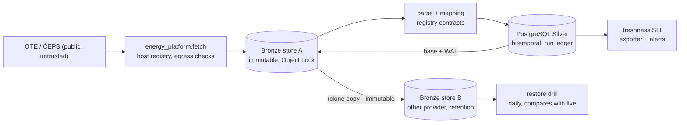

# energy-platform

High-availability ingestion of public Czech intraday energy data — the OTE continuous intraday
market (SOAP and daily XLSX), OTE day-ahead results and imbalance settlement, ČEPS system load —
with a **constrained extension path**: a junior engineer or a coding agent adds a new data source
by declaring it, and cannot change the platform while doing so.

Status: **complete (2026-09-23).** Five targets run as CronJobs from one Helm chart on a live demo
cluster and on a laptop; the fifth was added by a blind agent run through the contributor path
([`docs/09-acceptance-report.md`](docs/09-acceptance-report.md)).

## Reproduce it

```bash
git clone https://github.com/jalalhussein1982/energy-platform.git && cd energy-platform
make check          # lint, types, import layers, 800+ tests with the network disabled, harness gates
make local-up       # kind + Cilium + registry → image by digest → atomic deploy (migrate, smoke hooks) → egress test
make smoke-test     # smoke hook again, freshness metric present, restore-drill dry run
make local-down     # and `docker rm -f kind-registry`
```

Prerequisites: Docker with ≥ 4 GB, `kind`, `helm` ≥ 3, `kubectl`, `uv`, `make`, `openssl`, and the
PostgreSQL client library **libpq** (`apt install libpq5`, `brew install libpq`). No credentials,
no cloud account. Verified from a clean clone on a machine that had never seen the repository
(Ubuntu 24.04, 4 vCPU / 8 GB, GNU Make 4.3): see [`docs/07-operations.md`](docs/07-operations.md) §8.

More: `make db-test` (store suite on an ephemeral PostgreSQL; needs `initdb`), `make demo` (the
offline path on fixtures), `make rollback-drill`, `make helm-lint terraform-validate`.

## What runs

| Target | Source | Dataset | Added |
|---|---|---|---|
| `ote_intraday_market` (T1) | OTE SOAP `GetImPricePeriodE` | `ote.idm_continuous` | Phase 4 |
| `ote_intraday_market_xlsx` (T2) | OTE daily XLSX | `ote.idm_continuous` | Phase 4 |
| `ceps_load` (T3) | ČEPS SOAP `Load` | `ceps.load` | Phase 4 |
| `ote_dam` (E1) | OTE SOAP `GetDamPricePeriodE` | `ote.dam` | Phase 4, through the MCP server |
| `ote_imbalance_settlement` | OTE SOAP `GetImbalanceSettlementPeriodE` | `ote.imbalance_settlement` | Phase 7, **by a blind agent**, CLI only |

Each target is a directory under [`targets/`](targets/): a manifest, Bronze fixtures, and golden
values written by hand. The scope and the contracts are in
[`docs/01-data-scope.md`](docs/01-data-scope.md) and [`docs/04-contracts.md`](docs/04-contracts.md).

## Architecture



One library, thin clients (CLI, MCP server, CI), one Helm chart, three deployment profiles
(`local`, `tenant`, `own-cluster`) that differ only in values and Terraform. Bronze — the raw
captures — is the durable boundary: Silver can be rebuilt from it, and the restore drill proves
that daily. Orchestration is CronJobs plus a Postgres run ledger, no operators or CRDs in the core
chart. Details and two more diagrams: [`docs/architecture.md`](docs/architecture.md); the
decisions: [`docs/adr/README.md`](docs/adr/README.md).

## The live demo

- **Cluster:** two Hetzner `cx23` nodes running k3s (`nbg1`), built by
  [`deployment/own-cluster/terraform/roots/hcloud`](deployment/own-cluster/terraform/roots/hcloud).
- **Deploys:** the [`deploy-demo`](.github/workflows/deploy-demo.yml) workflow builds the image on
  GitHub, pushes it to GHCR by digest, and deploys with the job's **OIDC identity**. That identity is
  mapped to a namespace-scoped Role: no kubeconfig and no long-lived deploy token anywhere. The API
  refuses anonymous requests.
- **Storage:** Bronze store A is Hetzner Object Storage (COMPLIANCE Object Lock). Store B is OCI
  Object Storage in Frankfurt (a retention rule): another provider, another country.
- **Checked live on 2026-09-23:** the backup chain (WAL shipping, base backup, replication) and a
  **restore drill that reads only store B** matched live data. The runbook is
  [`docs/07-operations.md`](docs/07-operations.md) §4.1.
- **Cost:** about €14/month at Hetzner; OCI stays inside its free tier. `terraform destroy` removes
  the servers. The buckets are locked by design, and deleting them is the owner's decision.

## Adding a data source

Read [`docs/08-adding-a-target.md`](docs/08-adding-a-target.md): it is the whole procedure. There
are two routes ([ADR-022](docs/adr/ADR-022-source-admission-vs-adapter-addition.md)):

- **Route A:** the source is already admitted, so you add an adapter. The PR touches
  `targets/<id>/` only, and CI rejects anything else.
- **Route B:** the source is not admitted, so you stop. `energyctl validate` says
  `ADMISSION_REQUIRED`, and the PR is an admission request only. A maintainer decides on licence
  and semantics.

Three blind runs by a fresh agent (Codex CLI) passed both routes without help or core changes.
One of them refused a source whose free API is for non-commercial use only
([`docs/09-acceptance-report.md`](docs/09-acceptance-report.md)).

## How agents are constrained

- **Declared, not coded.** A target cannot contain fetch or normalisation code. AST and lint rules
  reject a hardcoded URL, `float()`, arithmetic, sockets or imports outside the allowlist
  ([ADR-027](docs/adr/ADR-027-target-capability-boundary.md)).
- **Registries are CODEOWNERS-only.** Datasets, metrics, units and hosts can't be invented in a
  target PR; `make pr-surface` fails a PR that touches anything outside one target.
- **Egress has one path.** Every outbound request goes through `energy_platform.fetch`, which checks
  the host registry, resolves and rejects private or metadata addresses, and checks every redirect
  hop. NetworkPolicy is the coarse layer ([ADR-026](docs/adr/ADR-026-egress-boundary.md)).
- **Authority levels.** Agents read, generate targets and propose PRs. Merging to `main`,
  production secrets, `terraform apply` and `kubectl` writes are Level 3
  ([ADR-006](docs/02-architecture-decisions.md)).
- **Branch protection.** `main` requires a PR, the 12 CI checks and a code-owner review
  ([`docs/branch-protection.md`](docs/branch-protection.md)).
- **MCP.** The golden path is exposed as eight tools, with writes confined to one target; `open_pr`
  prepares a bundle and never pushes.
- **Drift triage.** When a source changes shape, an LLM *proposes* a manifest-only repair from a
  bounded sample. Its answer is refused unless it names only the four allowed mapping operations.
  The prompt-injection tests use a model that obeys the injection
  ([`energy_platform/triage/`](energy_platform/triage/)).
- **The full picture.** [`docs/05-constraint-matrix.md`](docs/05-constraint-matrix.md) has 61
  failure modes, each with a gate and a negative test. [`docs/threat-model.md`](docs/threat-model.md)
  gives the mechanism, gate and residual risk for 15 threats.

## Deliberately not built

| Not built | Why | Where decided |
|---|---|---|
| A read API or consumer MCP over Silver (D-9) | the brief is ingestion; SQL on Silver is the interface | `02` §4.2 D-9 |
| The OpenAI-compatible LLM client (triage runs on a deterministic stub) | "pipeline built, LLM step stubbed" (D-10); the client must live in `fetch/` with its host registered | `02` D-10, ADR-009, plan P6-D4 |
| ENTSO-E adapters | a registration token and an admission row first | `01` §4, §10 |
| Gas intraday, a canary target group | out of v1 | `02` D-11, D-13 |
| TimescaleDB | plain PostgreSQL is enough at this volume | ADR-030 |
| A loader for a target's own `parser.py` | every committed target is served by the generic parsers | `05` §5 |
| One-week publication-latency campaign | closed without running for delivery (2026-09-23); no weekly latency figure is quoted | `03` Phase 4 |

## Assumptions and what they cost

The platform was designed against a reference environment, e-INFRA CZ / MetaCentrum: a shared
Rancher cluster, OpenStack and Ceph object storage. Each assumption was scored against three
scenarios for what the operator actually runs:

- **A:** shared enterprise Kubernetes (a namespace, no cluster-admin).
- **B:** own IaaS.
- **C:** a hyperscaler region.

A decision is robust if it survives all three without changing platform code. The full register,
with evidence, is [`docs/00-assumptions.md`](docs/00-assumptions.md) §2.

| # | Assumption | Holds under A / B / C | Cost if false | Verified |
|---|---|---|---|---|
| A-1 | shared cluster, namespace rights, no CRDs | Y / Y / Y | none; the tenant chart is strictly more portable | V-4 confirmed |
| A-2 | OpenStack IaaS without Magnum | N / Y / provider swap | rewrite one Terraform provider layer | V-5 confirmed |
| A-3 | S3-API object storage plus a second independent store | Y / Y / Y | none (`rclone` speaks the others) | V-6, V-12, V-13 confirmed |
| A-4 | in-house LLM inference with an OpenAI-compatible API | Y / Y / Y | none (the LLM is off the critical path) | V-7 confirmed |
| A-5 | identity is OIDC | Y / Y / Y | a namespace-scoped token with expiry as fallback | V-8, V-14 confirmed |
| A-6 | best-effort SLA | Y / Y / Y | none; recovery has no manual step | — |
| A-7 | open internet egress, no proxy | proxies are the norm | the single egress path honours `HTTP_PROXY`, so proxies are supported | V-9 confirmed |
| A-8 | quota-enforced namespace | Y / Y / Y | none; every workload has requests and limits | V-4 confirmed |
| A-9 | data centre in the Czech Republic | Y / Y / if region-pinned | none; residency is a declared attribute (the demo says `DE`) | — |
| A-10 | ingress, cert-manager and storage classes provided | Y / Y / Y | none; consumed by name | V-4 confirmed |
| A-11 | no managed Postgres | Y / Y / Y | none; the chart takes a DSN | V-10 confirmed |
| A-12 | sources reachable, not rate-limited by the network | Y / Y / Y | none; the platform enforces politeness | V-9 confirmed |
| A-13 | CI is GitHub Actions | Y / Y / Y | rewrite the wrapper YAML only ([`docs/ci-porting.md`](docs/ci-porting.md)) | — |
| A-14 | the `restricted` Pod Security Standard | Y / Y / Y | none; every pod is restricted-clean | V-4 confirmed |

## Repository map

```text
energy_platform/   the library: fetch, bronze, parse, mapping, silver, runtime, harness, mcp, triage
targets/<id>/      manifest.yaml, fixtures/, tests/golden/ — declaration only
deployment/        helm/ (one chart), local/ (kind), tenant/ (values), own-cluster/terraform/, image/, sandbox/
docs/              the numbered documents, ADRs, plans, admissions — index in docs/README.md
scripts/           helpers called only by Make targets
```

Documentation index: [`docs/README.md`](docs/README.md). The development log is
[`docs/progress.md`](docs/progress.md), and the agent instructions are [`CLAUDE.md`](CLAUDE.md)
(mirrored in `AGENTS.md`).
