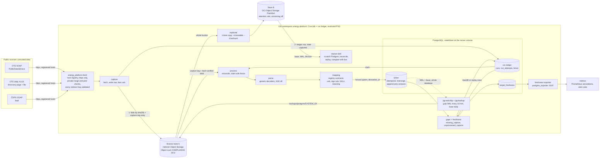
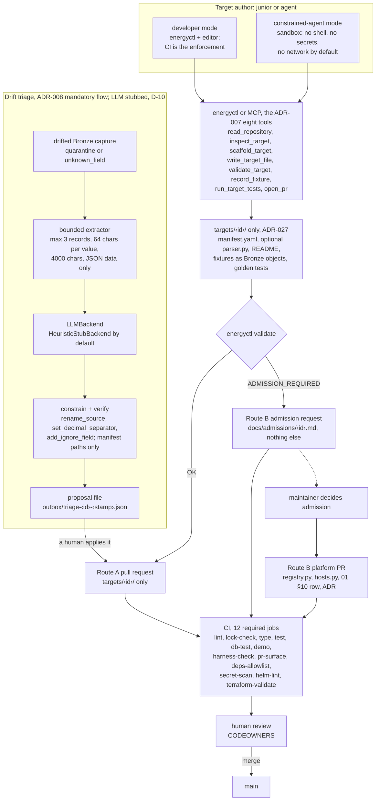
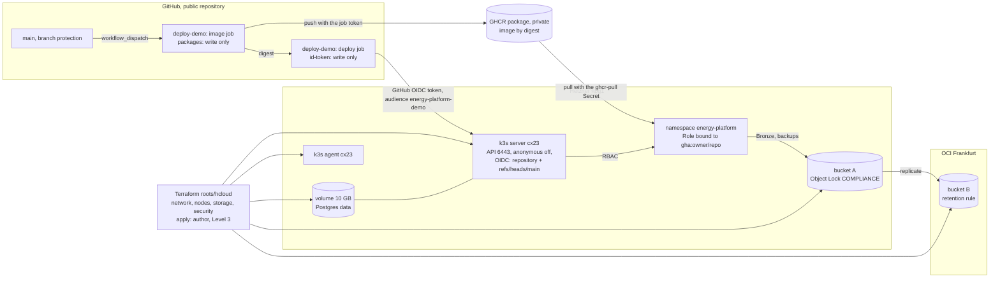

# Architecture

One library (`energy_platform`), thin clients (`energyctl`, the MCP server, CI), one Helm chart,
two Terraform roots (ADR-000, ADR-001). Sources are untrusted data; Bronze is the durable boundary
and Postgres is authoritative for Silver (ADR-002, ADR-024). Contributors own syntax, the platform
owns semantics (ADR-005), and nothing reaches `main` or the cluster without CI and a human
(ADR-006). The diagrams below are the demo environment (ADR-028); the security reading of each
arrow is `docs/threat-model.md`.

## 1. Data path

- Ordering is `FETCH → WRITE RAW → ACKNOWLEDGE → PROCESS` (ADR-004): the capture needs no
  database, and `reconcile` rebuilds the ledger from the capture log (ADR-024 §1–§2).
- Replay reads Bronze and never fetches; backfill is the only other fetching verb (ADR-024 §5).
- Egress layer 1 (`NetworkPolicy`): only capture and backfill pods reach the internet, on 443,
  private ranges excepted (ADR-026).
- Store B is written only by `replicate`; the drill reads B, never A (ADR-036 §3, §5).
  Archive paths carry the Postgres system identifier (ADR-036 amendment 1 §6).
- Freshness is the SLI; `source_unavailable` and `pipeline_failed` are separate metrics
  (ADR-012, ADR-037).

## 2. Contributor and agent path

- `pr-surface` fails a PR that mixes `targets/<id>/` with anything else or touches two targets;
  registry, allowlist and CI paths are named (05 C-39…C-41).
- In the sandbox, `open_pr` writes a bundle to `/outbox`; `scripts/apply_pr_bundle.py` runs
  outside, re-verifies paths and hashes, and never commits on `main` (05 C-51, C-53).
- Route B is a maintainer decision no gate automates (ADR-022 §1); the registries are
  CODEOWNERS paths.
- Triage never pushes and cannot express a unit, sign, host, URL, licence or cadence change
  (`docs/plans/phase-6.md` P6-D3; 05 C-58…C-61).

## 3. Deployment (demo)

- No kubeconfig or token is stored in CI; the admin client certificate stays with the author
  outside the repository (ADR-015, ADR-035 §2, V-14).
- 6443 is open to the internet because GitHub-hosted runner ranges do not fit the firewall;
  authentication and the namespace `Role` are the controls (ADR-035 §4).
- The same chart and `tenant` values deploy here; nothing needs cluster rights (ADR-028 §2).
