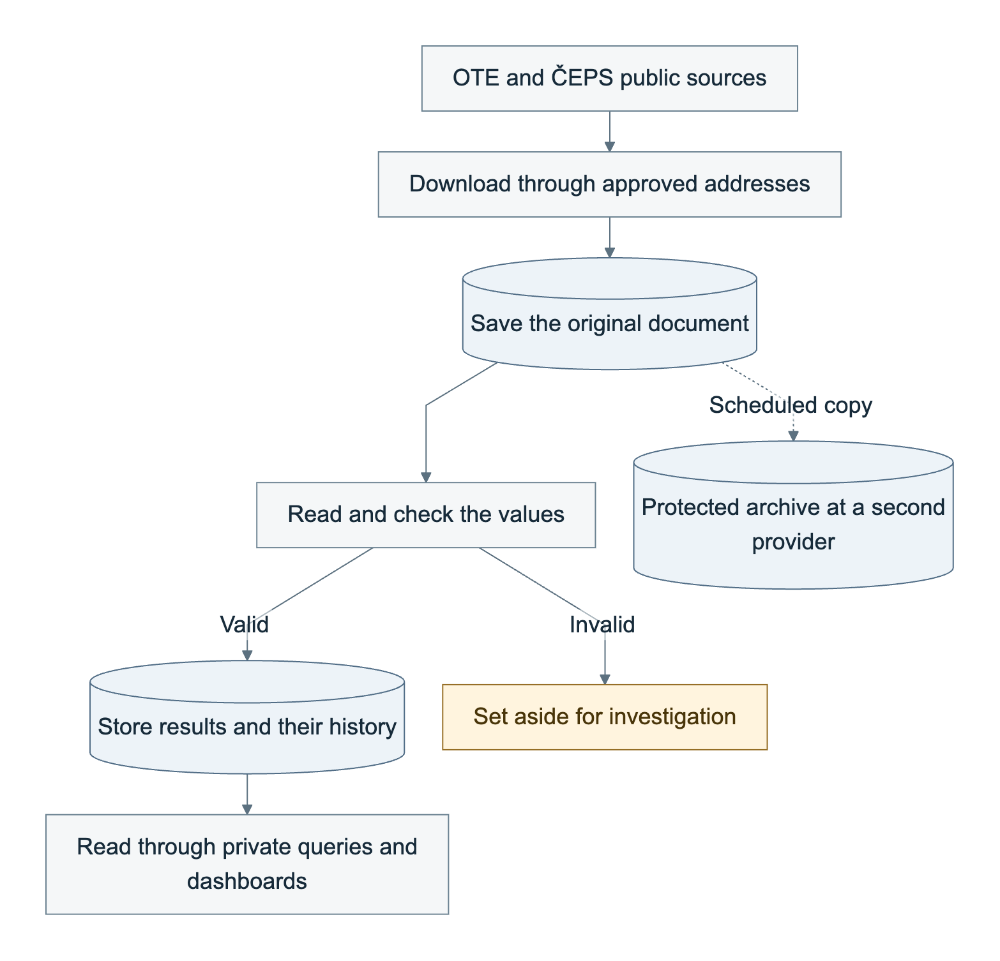
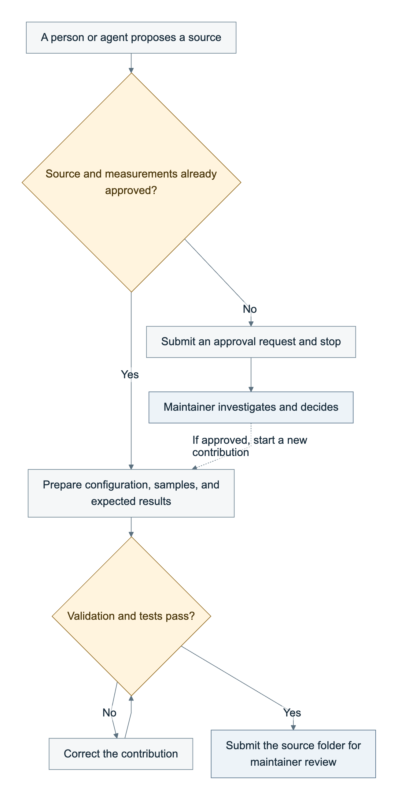
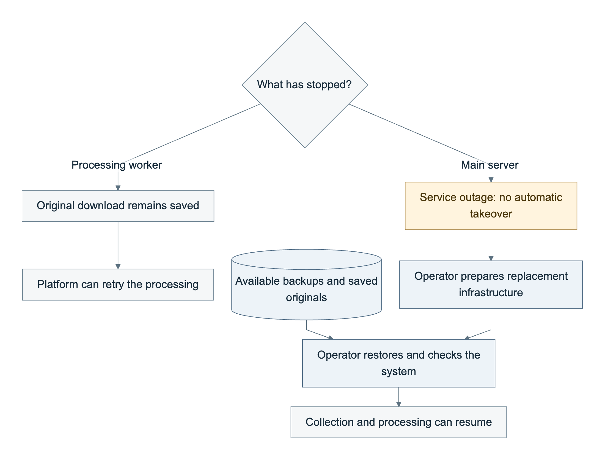
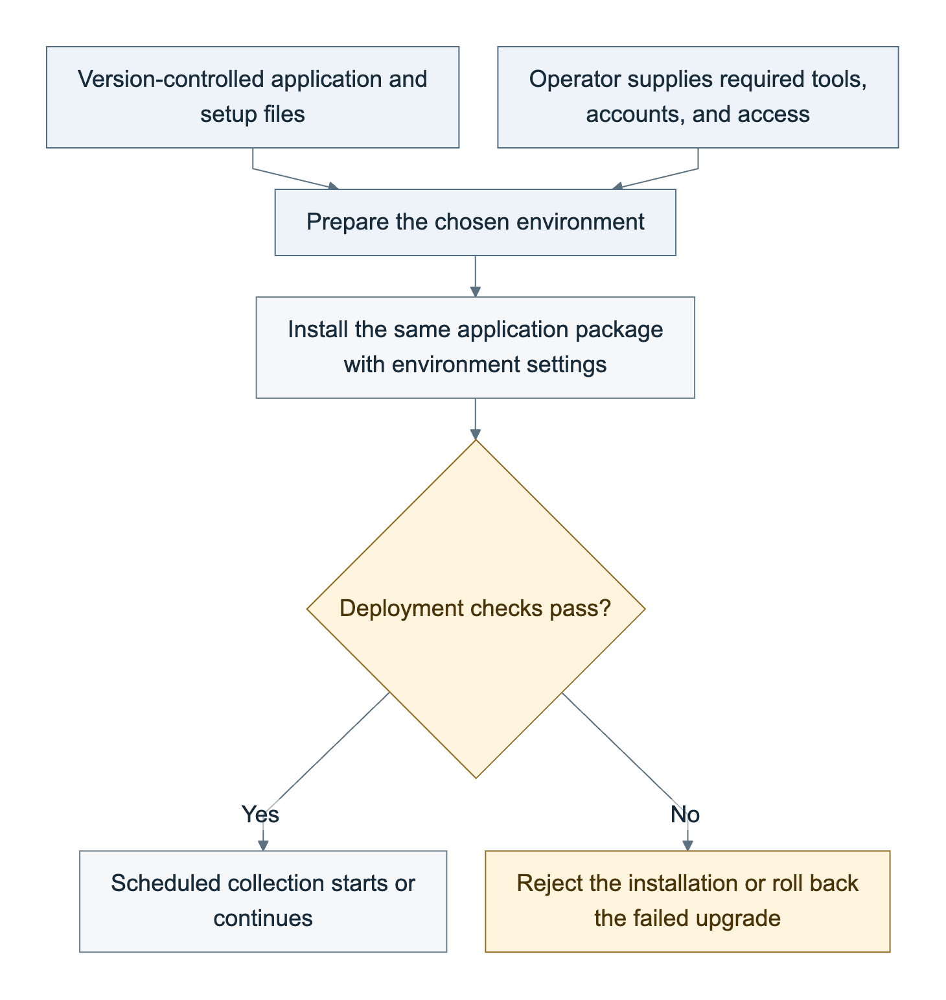

# Energy Platform — Final Report

**Collecting public energy data reliably, with a controlled way to add new sources**  
Jalal Hussein · 26 September 2026

Repository: [energy-platform on GitHub](https://github.com/jalalhussein1982/energy-platform)

## 1. The problem we were asked to solve

The assignment had two connected goals. The first was to build a system that regularly collects and processes public intraday energy data, keeps that data available, and can be deployed again from files in the repository. “Intraday” means within the delivery day: for example, electricity prices and trading volumes for each 15-minute period.

The second goal was to make the system safe to extend. A junior engineer or an AI coding agent should be able to add another source without introducing a separate set of downloading, error-handling, date-conversion, and deployment code each time.

These goals need to be solved together. A scraper can appear to work while collecting the wrong day, misreading a decimal comma, losing a source correction, or treating missing data as zero. Giving an agent freedom to write another independent scraper would repeat those risks with every addition.

We therefore built a shared data-processing platform and a restricted contribution process around it. The platform handles the difficult, reusable parts. Contributors describe the source and supply examples that demonstrate the expected result.

**The delivered result is a working data-collection and processing system, a reproducible deployment, and a tested process for adding sources. The high-availability requirement remains partly open: the current deployment has protected copies and tested recovery, but it cannot automatically take over when its main database and scheduling server fails.** That remaining work is explained in Section 6.

## 2. How we approached the task

We started by investigating the data, rather than choosing tools first. OTE, the Czech electricity market operator, and ČEPS, the Czech transmission-system operator, provided suitable public sources. We checked their interfaces, response formats, time conventions, and available information about reuse. The chosen use case is market monitoring and research using published data; it is not a real-time trading feed.

Before adding sources, we defined the rules that every source must follow: what each measurement means, its unit, how dates and delivery periods are represented, how missing values are handled, and how corrections are recorded. We then built the checks that enforce those rules.

This order was deliberate: **build the contributor instructions and safeguards before asking contributors or agents to add scrapers.** It means an agent receives a bounded task, examples, validation commands, and clear reasons when a change is rejected.

Development followed written phase plans, recorded design decisions, and automated checks before commits. Separate reviewing agents challenged the design and implementation in three review rounds. Findings led to fixes, additional tests, or an explicit statement of what had not been delivered. The same approach was used when the running system exposed defects.

## 3. What we built

The platform is a Python application that downloads source documents, checks and converts their contents, and stores the results in a PostgreSQL database. Scheduled jobs run it automatically. A command-line tool, `energyctl`, gives contributors and operators access to the same underlying functions that run in deployment.

There are seven configured collection targets. A **target** is one source configuration with its own request, schedule, and field mapping. Seven targets do not mean seven unrelated providers: several collect different OTE datasets or different published versions of the same dataset.

| Collection target | What it provides | Schedule and recorded status |
| --- | --- | --- |
| OTE intraday market, web service | Prices and traded volumes for 15-minute electricity periods | Every 15 minutes; live data collected |
| OTE intraday market, spreadsheet | A second copy of the same market results, including additional price and volume fields | Every 15 minutes; live data collected |
| ČEPS system load | Measurements of load on the electricity system | Every 15 minutes; live data collected |
| OTE day-ahead market | Prices for electricity to be delivered the following day | Four reads after the expected daily publication; live data collected |
| OTE daily imbalance settlement | Initial prices and volumes used in settling electricity imbalances | Hourly; live data collected |
| OTE monthly imbalance settlement | The monthly settlement version for the previous month | Monthly; first scheduled capture due 1 October 2026 |
| OTE final imbalance settlement | The final settlement version for a month roughly four months earlier | Monthly; first scheduled capture due 1 October 2026 |

Recent days are also checked again on defined schedules because providers may revise their published data. The two monthly targets have passed their sample-based tests and are deployed, but their first scheduled live captures are still pending in the recorded delivery status.

The delivery includes the application, source configurations, tests, contributor guide, deployment files, infrastructure definitions, private dashboards, monitoring, backup and recovery procedures, and records of the reviews and operational tests.

## 4. How data moves through the system

The original document is saved before its values are used. The diagram shows the main path and the separate archive copy.



*Figure 1. Saved originals make it possible to investigate mistakes and process the data again. A bad document is kept as evidence, but its invalid values are not added to the results.*

The processing path has five steps:

1. **Download through a controlled route.** The platform contacts only approved source addresses. It limits request attempts and response sizes, and checks redirects so a source cannot send it to an unrelated or private service.
2. **Save the original before processing it.** Each downloaded document is retained exactly as received, with a record of when and where it was collected. The raw archive is called **Bronze** in the repository. The live deployment protects objects against deletion or replacement during a 90-day retention period and copies them to a second provider.
3. **Read and check the values.** Shared processing code uses the target configuration to identify dates, fields, units, and numbers. A document with an invalid required value is set aside with a reason, while its original remains available for investigation.
4. **Store usable records with their history.** The processed database is called **Silver**. A corrected source value becomes another recorded version, preserving the previous one. Readers can query the current valid values or inspect their history and origin.
5. **Check whether expected data arrived.** The platform tracks scheduled work, detects missed downloads and unprocessed documents, and reports whether data is pending, late, incomplete, unavailable at the source, or blocked by a processing failure.

Keeping the original documents matters when a mistake is discovered later. We can fix the processing rule and process the saved documents again, without relying on the source to keep serving the old files. Each result records which input and processing version produced it.

Energy data has several easy-to-miss details. The shared code handles these consistently:

- A day normally contains 96 quarter-hours, but the daylight-saving changes produce days with 92 or 100. Tests cover both cases.
- A missing value remains missing. It is not converted into a zero.
- Negative prices are preserved where the source permits them.
- Decimal commas, timezones, and units are declared explicitly. Contributors do not have to invent their own conversions.

The two OTE intraday targets also provide a cross-check. Their overlapping values are compared, with a defined primary source for each measurement.

### A real incident showed why these controls matter

On 23 September, a file-discovery bug caused the spreadsheet target to save that day's spreadsheet against earlier delivery days. The comparison with OTE's web service recorded 9,544 disagreement events. At that point those events were not yet connected to an active alert; the review identified that gap, and the alerting path was subsequently added and tested.

The repair also exposed a recovery problem: manually deleting incorrect database rows did not last, because rebuilding from the original downloads brought them back. The platform now records a permanent decision that a particular capture is invalid. Current queries, reprocessing, and recovery all honour that decision. In this incident, 113 incorrect captures were marked invalid, while the original files were retained as evidence.

## 5. How another person or an agent adds a source

The usual contribution is a small source folder, not a new standalone scraping program. It contains a configuration file, example inputs, expected outputs, tests, and a short explanation of the source.

The configuration file is called a **manifest**. It states where to download the data, when to do so, which fields to read, and how those fields match the platform's approved measurements. Downloading, retries, time handling, storage, and deployment remain shared platform responsibilities.

### Two paths, depending on whether the source is already approved



*Figure 2. Passing tests leads to human review. An unapproved source first needs a maintainer's decision; the contributor cannot change the platform's rules to make it pass.*

For an **approved source**, the contributor follows the guide to:

1. Generate the source folder with `energyctl`.
2. Fill in the manifest using an existing target as an example.
3. Add sample documents, including normal and difficult cases.
4. Write the expected values by inspecting the samples independently.
5. Run validation and tests.
6. Submit a pull request containing only that target's folder for maintainer review.

The expected values are important. If someone simply copies the program's output into its test, the test can repeat the same mistake. The guide therefore requires independently checked expectations, and the maintainer reviews them before accepting the contribution.

For a **source that is not approved**, the contributor submits an admission request instead. It describes the source, reuse terms, measurements, units, and example format. A maintainer decides whether and how it belongs in the platform. The contributor cannot make a failing check disappear by inventing a unit, changing the approved-source list, or editing the shared application.

The current targets use the platform's built-in readers. If a future source needs a format they cannot handle, support must first be added through a separately reviewed platform change. Running a contributor's custom parser is not currently supported.

The complete procedure is in the [contributor guide](../08-adding-a-target.md).

### How we limit mistakes and agent authority

Written instructions are supported by automated checks. The repository documents **77 specific failure modes**, each linked to a control and a test that deliberately introduces the problem to check that it is rejected.

| Potential mistake | How the platform responds |
| --- | --- |
| A contributor adds their own downloading code | The target checks reject it; downloading belongs in the shared application |
| A source names an unapproved address, dataset, or measurement | Validation requests maintainer approval |
| A unit or date rule is wrong | Checks against approved definitions and expected outputs expose the inconsistency |
| A contribution changes the platform as well as its target | The pull-request check rejects the mixed change |
| A test contacts a live website | Network access is disabled in unit tests, which check individual components |
| A credential is placed in configuration or code | Validation and credential scans check for it |
| Someone skips tests or suppresses checks to obtain a pass | Target checks reject those shortcuts |

Twelve automated checks and a review by the designated maintainer are required before a change is normally accepted into the main repository. They reduce common mistakes; they do not prove that every accepted mapping is correct. Human review of the source meaning and expected values remains necessary.

Agents can use the command line or a restricted tool interface called **MCP**. Both call the same platform functions. The restricted interface offers nine specific tools for reading documentation, preparing a target, checking it, and preparing a contribution or admission request for someone else to submit.

There are two different levels of protection:

- **In the restricted environment**, the agent has no general command shell, infrastructure tools, or production credentials. Its writes are confined to the permitted contribution paths, and live source access requires an explicit session setting.
- **In an ordinary developer session**, the agent has broader capabilities. Instructions, permission controls, automated checks, and maintainer review provide the safeguards. The contribution trials used this mode, so they do not demonstrate the strength of the restricted environment against a determined attacker. Repository administrators can also bypass branch protection.

Merging changes, deploying infrastructure, changing the running cluster, and altering production data remain maintainer responsibilities under the contribution policy.

The collection system itself does not need a language model to operate. A framework exists for proposing repairs when a source changes format, but it currently uses a fixed test substitute rather than a live model. Any future model would propose a limited change for testing and review; source content is treated as untrusted data, not as instructions granting operational authority.

## 6. Reliability, recovery, and the remaining availability gap

The live demonstration uses two servers at Hetzner, with original documents and database backups copied to Oracle storage. Using a second provider protects against relying on one storage service for recovery. It does not, by itself, keep processing running during a server outage.



*Figure 3. A failed worker can be retried while the rest of the system is available. Losing the main server requires an operator. This is the recovery procedure; a complete server-loss exercise has not yet been demonstrated.*

The current system handles several failures:

| Failure | Expected response and its limit |
| --- | --- |
| A processing worker stops midway | Saved work can be retried. The work-tracking mechanism prevents an expired worker from committing a stale result after another worker takes over |
| A download or processing run is missed | The platform detects the gap and can retry or process a saved download; fetching old data depends on the source still providing it |
| The source publishes a correction | A later download is recorded as a new version, preserving the earlier value |
| A release fails its deployment checks | The deployment returns to the previous application release. This does not automatically undo database changes or incorrect data already written |
| The main server fails | Collection and processing suffer an outage until an operator restores the system on replacement infrastructure |
| The first storage provider is unavailable | Recovery can use the independent copy, subject to how much had been copied successfully before the failure |

Database changes are sent to backup storage every ten minutes, with a full database backup daily. Copies to the second provider are scheduled every fifteen minutes. The design aims to limit lost processed data to about fifteen minutes after a database-node failure, assuming successful backup transfers. Loss of the first provider has a different limit: the copying interval plus the time needed to finish the copy. These are conditional recovery objectives, not measured guarantees for a real provider outage.

Recovery is tested in two ways. One restores a database backup, including historical records. The other builds a fresh database from the saved source documents and checks that the running code reproduces the latest processed values for those inputs. Rebuilding with current code does not recreate every historical output produced by retired code; database backups preserve that older history.

The latest recorded successful manual exercise took about **12 minutes for the restored-database check and 32 minutes for the rebuild from source documents**, around 45 minutes for the complete test job. Those times exclude creating replacement infrastructure and restoring all access and schedules. They are not an end-to-end outage-recovery time.

**Automatic failover is the principal unfinished part of the original brief.** One server still hosts the only database and the only Kubernetes control plane—the component that schedules and manages work. The second server does not replace those functions automatically.

Closing this gap requires more engineering: a three-server control plane, replicated PostgreSQL with a working backup arrangement, updated infrastructure definitions, and a measured test in which a server is deliberately lost. It cannot be claimed complete by changing a setting. The project estimates roughly twice the current monthly cost for that demonstration, before its operational behaviour is proven.

### Monitoring now reaches an operator

The platform evaluates twelve alert rules covering late data, processing failures, unavailable sources, disagreement between the two intraday feeds, and failed or stale backup and recovery work. It uses Prometheus to evaluate the rules and Alertmanager to route messages.

On 26 September, a deliberate failure produced both an alert-log entry and an email in the operator's inbox in under three minutes. The subsequent resolved message reached both destinations as well.

Two late-data alerts—for day-ahead results and daily imbalance settlement—currently go only to the log. Their expected publication times need better modelling so that normal overnight behaviour does not produce misleading notifications. Other alerts configured to page the operator continue to use email.

## 7. What the testing demonstrates

The evidence combines automated tests, contribution exercises, reviews, and tests of the running deployment. The [test record](../10-tests-performed.md) links to the detailed results.

| Evidence | Recorded result |
| --- | --- |
| Application and rule checks | 960 passing offline tests, plus 36 tests against PostgreSQL |
| Contribution exercises | Four agent runs met their acceptance criteria without implementation guidance: three target additions and one correct request for source approval |
| Strictly fresh agent exercise | An empty agent profile, with no prior memory or connectors, produced a target-only pull request in 4 minutes 55 seconds; all twelve automated checks passed |
| Independent review | Three rounds; the latest six findings resulted in five fixes and an explicit outstanding availability limitation |
| Reproduction from a clean checkout | The local environment was successfully built on a fresh machine; later reruns checked the replacement local storage and alerting components |
| Recovery | Successful manual database-restoration and raw-document rebuild exercises after defects found by scheduled runs were fixed |
| Failed-release handling | Deliberately failing deployment checks demonstrated rollback |
| Operator notification | Failure and resolution messages reached both the log and the operator's inbox |

The contribution exercises support the claim that someone can follow the documented process without changing the core application. One run specifically followed the junior contributor's command-line guide. **All four runs used agents; no separate trial with a junior human is documented.** The first three agents had some repository-related global memory. The fourth had an empty profile, but could read the repository's existing examples, as a new contributor normally would.

The test history also includes failures. Scheduled recovery exercises on 24 and 25 September exposed memory and comparison problems. These were corrected, and subsequent manual exercises passed. The evidence therefore supports demonstrated recovery procedures, not a claim that every nightly recovery test has always succeeded.

Several longer-term and adversarial checks remain unperformed: automatic failover, a complete provider outage, the monthly targets' first scheduled capture, a daylight-saving transition experienced by the live deployment, expiry-related failures, and a contributor deliberately attempting to defeat the full workflow. Individual rejection tests already exist; the broader [misbehaviour test plan](../11-misbehaviour-test-plan.md) is prepared for another engineer and is not counted as completed testing.

## 8. Deployment, access, and running cost

**Infrastructure as code** means the servers, network, firewall, storage, and application setup are described in version-controlled files, so another engineer can recreate the environment rather than reconstructing it from manual notes.

Terraform describes the cloud infrastructure. Kubernetes runs the scheduled jobs. Helm packages the application's deployment settings. The same application and deployment package support three arrangements:

- **Local development:** a Kubernetes environment on a laptop, including a database, two local archive stores, and monitoring. It needs the documented development tools, but no cloud account or source credentials.
- **An existing organisation's cluster:** installation within an allocated area of a shared cluster, with the database and storage supplied through configuration. The core application does not require cluster-wide administration or additional Kubernetes resource types.
- **An independently provisioned cluster:** the infrastructure files create the cloud environment. This is the path used for the live Hetzner demonstration, with Oracle providing the independent storage copy.

Cloud accounts, credentials, and initial access setup still belong to the operator. Those prerequisites are documented. Automated deployment uses a short-lived GitHub identity; it does not keep a permanent cluster administrator credential in the build system. Application images are fixed to exact versions, and workloads have restricted permissions and resource limits.



*Figure 4. The same deployment package serves a laptop, a shared cluster, or the independently provisioned demo. A failed upgrade returns to the previous release; that rollback does not undo data already written.*

To reproduce the local environment after installing the prerequisites in the [README](../../README.md):

```bash
git clone https://github.com/jalalhussein1982/energy-platform.git
cd energy-platform
make local-up
make smoke-test
```

Data is available through read-only database queries, written in SQL. Private Grafana dashboards show prices, volumes, system load, and collection health. There is no public data website or public data API. An authorised operator can demonstrate the dashboards through a protected local connection. A separate observer account lets another engineer inspect job status and logs without receiving write access or credentials; that account does not provide dashboard access.

This access model also reflects the recorded reuse position. **OTE's written response permits internal collection and storage and refuses publication of samples to third parties. ČEPS has not replied; the maintainer adopted the same internal-use-only restriction as a conservative project policy.** The repository therefore contains synthetic examples with realistic structures, not published copies of collected market data. Public redistribution would require the relevant permission first.

The documented demonstration cost is approximately **€14 per month**, with Oracle storage within the project's free allowance. This is the project's recorded estimate, not a new price quotation. Storage costs can continue after the servers are stopped: retained objects cannot be removed before their protection period expires. The shutdown procedure preserves those archives.

For a team handover, the infrastructure state file—the record Terraform uses to manage the resources—should move from the maintainer's laptop to a shared, access-controlled location. The laptop setup also uses RustFS for local storage after the previously used images became unavailable; its required retention and storage behaviour was tested before adoption. The live cloud storage was unaffected by that replacement.

## 9. Remaining work and handover priorities

The next operational priority is to complete and measure automatic failover. That is the main gap between the working demonstration and the full high-availability requirement.

The other follow-up items are narrower:

- Model publication expectations for the two noisy late-data alerts, then test their notifications again.
- Observe and verify the monthly settlement targets after their first scheduled run on 1 October.
- Run the prepared adversarial contribution tests and a separate onboarding exercise with a junior human.
- Continue longer-term operation and measure source-publication delays. The planned week-long observation campaign was not completed, so no dependable publication-latency promise is made.
- Follow up with ČEPS about reuse and its two load series. The collected quarter-hour samples showed identical values for series labelled with and without pumping, while a daily aggregate differed. Both are preserved as published; the platform does not assume they mean the same thing.
- Complete team ownership of infrastructure state, access, alert handling, and ongoing recovery checks.

Some extensions were deliberately left outside this delivery: ENTSO-E and gas targets, a public read API, execution of custom target parsers, a live language-model repair service, and trial releases applied to only a small subset of targets. Moving archives to a separate cold-storage tier is implemented in configuration and tested at the code level, but has not been exercised against a real cold store. These are separate from completing failover for the sources already supported.

## Supporting material

This report uses the local repository at commit `416c816` and the operational evidence recorded through 26 September 2026. The latest deployment recorded in that evidence is Helm revision 29, built from `327e45e`. Test results and live observations above are the documented project results; preparing this report did not rerun the deployment or the operational drills.

| For more detail | Document |
| --- | --- |
| Application overview and local prerequisites | [Repository README](../../README.md) |
| Why the design was chosen | [Architecture decisions and amendments](../adr/README.md) |
| Source investigations and reuse decisions | [Source verification](../06-source-verification.md) |
| The 77 checks and their tests | [Constraint matrix](../05-constraint-matrix.md) |
| Adding a source | [Contributor guide](../08-adding-a-target.md) |
| The four contribution trials | [Acceptance report](../09-acceptance-report.md) |
| Deployment, incidents, backup, recovery, and alert evidence | [Operations runbook](../07-operations.md) |
| Completed tests and planned challenge tests | [Test record](../10-tests-performed.md) · [Misbehaviour test plan](../11-misbehaviour-test-plan.md) |
| Latest review findings and responses | [Review response](../reviews/2026-09-25-codex-review-response.md) |
