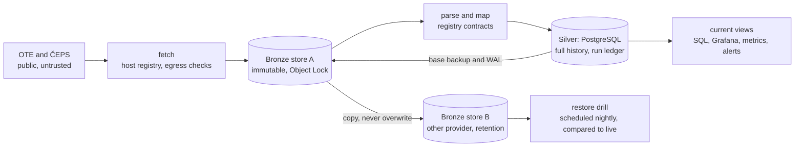
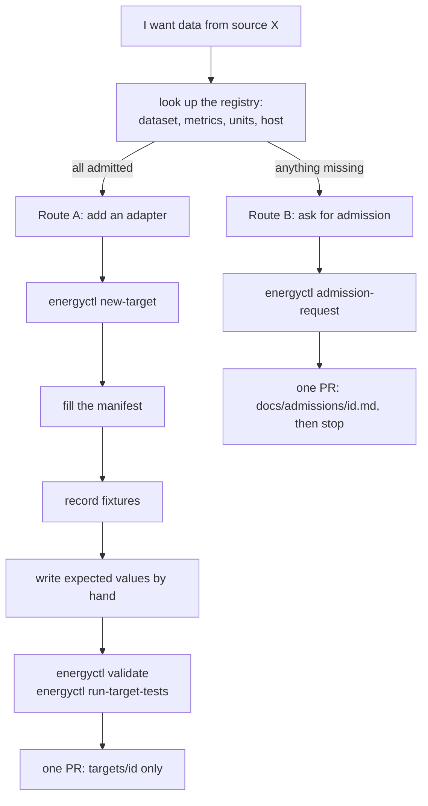

# Energy Platform — Final Report

Sep 25, 2026 · @Jalal Hussein

## The task, and the short answer

The brief asked for a high-availability system that scrapes and processes public intraday energy data, with deployments and infrastructure as code, built so that someone else can add a new scraping target easily. It also asked how we would lead and constrain AI agents so that a junior person, or an agent, can add a scraper as code or as a merge request with a minimum of bad engineering practice, and how we would mitigate what does slip through. Environment was our choice, as long as it can be reproduced from the infrastructure code. What data to collect was left to us.

We built and deployed a working platform for public Czech energy-data ingestion: seven declarative targets from OTE (the market operator) and ČEPS (the grid operator), every raw download kept immutable in two object stores at two providers, a PostgreSQL database with full history, reproducible infrastructure and a constrained contributor workflow. Fresh offline and PostgreSQL tests pass, and the live system is capturing and processing data on a two-node Hetzner cluster built from Terraform and one Helm chart; the same chart runs on a laptop from a clean clone. Contributor trials demonstrate both adding supported targets and escalating unadmitted sources.

The availability claim needs its boundary. The current low-cost deployment provides durable copies and drilled recovery machinery, but it has a **single database and control-plane failure domain**: one k3s server hosts the only PostgreSQL. It is a recoverable single-primary deployment, not one with automatic failover. Three independent reviews found and we closed defects in scheduling, release-aware replay, the restore drill's comparison and operational alerting; the last of these is now evaluated and delivered rather than merely defined. The failover demonstration is the one acceptance item still open. It is engineering as well as cost: the Terraform module builds one server and embedded etcd needs three, the replicated PostgreSQL needs an operator with its own backup chain before the nightly drill accepts it, and a node loss has to be drilled and timed, at roughly twice the monthly cost. Alerting is evaluated and delivered to a log; no person is notified until the maintainer wires a channel, for which the chart now takes the credential from a Secret.

The answer to the second half of the brief is a boundary first and a review second. A new target is a directory holding one YAML manifest, sample downloads and expected values. It contains no fetching or parsing code, because the platform accepts none. Seventy-seven named bad practices, from a hardcoded URL to a naive datetime to a network call in a unit test, each have a gate — static, runtime, deployment or procedural — and a negative test. Four contribution exercises by agents passed the documented acceptance criteria: three adapter additions (one CLI-only, following the guide literally) and one correct escalation to an admission request; one adapter run used a strictly empty profile with no memory and no connectors.

Repository: [github.com/jalalhussein1982/energy-platform](https://github.com/jalalhussein1982/energy-platform). This report describes the repository at commit `6bc8021` (2026-09-25); the live demo runs Helm revision 28, built from `d5fa9ce`, the last commit deployed at the time of writing. Numbers at that commit: 14 phases, 41 architecture decision records with dated amendments, 77 named constraints, 960 offline tests plus 36 on PostgreSQL, three external reviews answered finding by finding.

## What we built

One Python library does all the work, and everything else is a thin client of it: a command line tool called `energyctl`, an agent-facing MCP server, the CI checks, and the Kubernetes Jobs. Data flows through four stages that keep raw and refined strictly apart.



Reading left to right: every download is stored exactly as received in Bronze, under a write-once lock, before anything looks inside it. Parsing and mapping produce rows in Silver, a PostgreSQL database that never overwrites a value; a corrected price becomes a new version next to the old one, and the current view picks the newest valid one. Silver can be thrown away and rebuilt from Bronze. A scheduled drill does that into a scratch database and compares the result with live under a stated rule: for every raw payload live holds, the running code must reproduce the value of live's newest derivation. Versions produced by retired code are history that the physical backup keeps, and the drill's first phase restores that backup.

The pieces:

| Piece | What it is | Where |
| --- | --- | --- |
| Core library | fetch, Bronze, parse, mapping, Silver, run ledger, recovery, drills, the alert receiver | `energy_platform/` |
| Targets | one directory per data source: a manifest, sample downloads, expected values; no code | `targets/` (7 today) |
| Contracts | the registry of admitted datasets, metrics, units and hosts; a target may only use what is listed | `energy_platform/contracts/` |
| Chart | one Helm chart, three profiles that differ only in values: laptop, tenant namespace, own cluster | `deployment/helm/` |
| Infrastructure | Terraform for the Hetzner cluster, its firewall and volume, the Hetzner and Oracle object stores | `deployment/own-cluster/terraform/` |
| Orchestration | Kubernetes CronJobs plus a run ledger in Postgres; no operators, no custom resources | chart templates |
| Observability | a freshness exporter, twelve alert rules, a Prometheus and Alertmanager in the namespace, a receiver whose log is the delivery record, the operator's channel by values with its credential in a Secret, private Grafana | chart templates, ADR-037, ADR-039, ADR-040 |
| Guardrails | 77 named constraints, each with a gate and a test; the contributor guide; the MCP server for agents | `docs/05`, `docs/08`, `energy_platform/mcp/` |
| Decisions | 41 architecture decision records, frozen once accepted, amended by dated additions | `docs/adr/` |

Seven targets, four cadences. Three run every 15 minutes (the two intraday-market transports and ČEPS load): a capture Job asks the source for the current delivery day, a process Job maps what changed, and once a day a recapture Job re-reads recent days for corrections. The day-ahead target reads four times after publication, the daily settlement target hourly, and the two monthly settlement targets on the first of the month; those two have not reached their first scheduled capture yet. A gaps Job notices slots that never arrived and writes a freshness state per target. Backups ship the database's write-ahead log every 10 minutes and a full base copy daily, both into Bronze store A, from where replication copies everything to store B at another provider every 15 minutes.

## How it stays available, and where that stops

There is no web server, so availability here is about data and about recovery. What the deployment provides, and what each failure costs, stated as design bounds with their assumptions:

| What fails | What happens | Bound and assumption |
| --- | --- | --- |
| A worker pod mid-run | nothing is lost: the run ledger leases work with a fence; a second worker cannot commit a stale result, and the next tick retries | none |
| The database node, store A up | the write-ahead log ships to Bronze store A every 10 minutes and a base backup lands daily; the service is down until an operator restores | Silver RPO 15 minutes under successful shipments; the restore is the operator's |
| Bronze store A, or Hetzner as a provider | replication copies raw captures and the backup chain to store B at Oracle, copy-only, never overwrite | RPO = the 15-minute replication interval plus copy time, under successful jobs and an available provider; no provider-loss experiment has been run |
| The whole environment | Silver is derived; the drill rebuilds it from store B under the stated rule | the warm phases were timed once (777 s against the restored database, 1 216 s for the Bronze-only rebuild, 2026-09-24); replacement infrastructure, identities and resumed schedules have not been timed |
| A bad deploy | a migrate hook, a storage probe and a smoke run gate the upgrade; a failed gate rolls the release back, shown twice on the demo | a completed migration and data written by a bad release are not undone by Helm; the repair is an invalidation, a replay, or a restore |
| The k3s server | the only PostgreSQL and the only scheduler are on it: an outage, ended by the restore procedure on replacement infrastructure | no automatic failover; the production path (three servers, CNPG with replicas) is a values and Terraform change that is not exercised |

The raw store is the durable boundary. Every capture is written once under a compliance lock, so neither a bug nor an operator can silently change history. Corrections are recorded as new versions; known-wrong captures are recorded as invalidations, a decision the current view, replays and the drill all honour. The derivation identity of every row now carries a digest of the code that produced it, so a fix in platform code replays as a new derivation instead of colliding with the old one.

Alerting is evaluated, not only defined. A Prometheus in the namespace loads the same twelve rules the chart has shipped as a ConfigMap since the freshness design, scrapes the exporter and a namespaced kube-state-metrics, and hands firing and resolved alerts to an Alertmanager that delivers them to a receiver on the platform image; its log is the delivery record. That is delivery, not notification: nobody is paged until the maintainer wires a channel by values, and the chart takes that channel's credential from a Secret the operator creates, refusing at render a credential typed into values or a route to a receiver that does not exist. The delivery drill creates a restore-drill Job that fails on purpose and waits for the `firing` and then the `resolved` delivery; it runs on the laptop profile as part of the gate and passed on the demo on 25 September (firing delivered two minutes after the failure, resolved one minute after the deletion). Its first live evaluation also corrected the two Job-failure rules, which had paged for day-old failed Jobs kept as records after a later success.

Reproducibility is one command per environment once the owner's prerequisites exist: cloud accounts, credentials, two repository variables, the namespace Secret and the Terraform state are created by the owner and documented; nothing else is made by hand.

- **Laptop:** `make local-up` builds the image, creates a kind cluster with Cilium, generates all credentials, deploys the chart with two local object stores, Postgres and the alerting stack, runs the migrate and smoke hooks, and finishes with an egress test. `make smoke-test`, `make rollback-drill` and `make alert-drill` follow. This was run from a clean clone on a machine that had never seen the repository, again after the object-store replacement, and again with the alerting stack.
- **Live demo:** `terraform plan` and `apply` build two Hetzner servers, a private network, a firewall that allows SSH only from the maintainer's address, a volume, a locked Hetzner bucket and an Oracle bucket. GitHub Actions then deploys the chart on every push to main, authenticating to the cluster with a short-lived OIDC token; no long-lived kubeconfig exists in CI.
- **Tenant namespace:** the same chart in someone else's cluster with external Postgres and stores set by values.

Every image is pinned by digest, every GitHub Action by commit, every pod runs under the restricted security profile with resource limits, the core chart needs no custom resources, and every pod starts under default-deny network policy with a gate that refuses to start work until the policy is provably in force.

## What it ingests today

Seven targets from the two Czech operators, chosen after looking at what is actually public, machine-readable and dated. The intraday market is captured twice, through two different transports, so the platform can cross-check one against the other.

| Target | Source and interface | What the rows are | Cadence | Live data | Who added it |
| --- | --- | --- | --- | --- | --- |
| OTE intraday market (T1) | OTE SOAP web service, price per period | 15-minute continuous intraday prices and volumes | every 15 min, corrections re-read daily | yes | maintainer, Phase 4 |
| OTE intraday market XLSX (T2) | the daily spreadsheet OTE publishes | the same market, second transport, min and max prices too | every 15 min | yes | maintainer, Phase 4 |
| ČEPS system load (T3) | ČEPS SOAP web service | quarter-hour grid load, two series the source labels "with" and "without pumping"; on every quarter-hour item read so far the two were equal, a question put to ČEPS and unanswered | every 15 min | yes | maintainer, Phase 4 |
| OTE day-ahead market (E1) | OTE SOAP, day-ahead prices | hourly and 15-minute day-ahead prices | four reads after publication | yes | maintainer, through the agent MCP server |
| OTE imbalance settlement, daily | OTE SOAP, settlement periods | imbalance prices and volumes, first version | hourly | yes | a blind agent, CLI only |
| OTE imbalance settlement, monthly | the same service, version 1 | the previous month's settlement | monthly | first run 2026-10-01 | maintainer, PR #4 |
| OTE imbalance settlement, final | the same service, version 2 | the final settlement, four months back | monthly | first run 2026-10-01 | a strictly blind agent, PR #5 |

The 22 September incident, described later, is why T1 and T2 both exist: when T2 briefly stored the wrong day's spreadsheet, T1 was the system of record and the cross-check wrote 9,544 mismatch events within minutes.

Two facts about the sources shape what we can show. Both operators answered or were asked about reuse, and the answer is internal use only, no publication to third parties. So every sample file in the repository is synthetic, no real value from either source is committed, and there is no public dashboard by design. Time is the other trap: every row carries an aware timestamp and a delivery interval, days with a daylight-saving change have 92 or 100 quarter-hours instead of 96, and Czech sources use a decimal comma, which the manifests declare explicitly rather than guessing.

## How to see the data

The interface is SQL on the Silver database, and two windows sit on top of it. None of them is reachable from the internet, because the sources' terms allow internal use only.

1. **SQL on the current views.** Every consumer reads `observations_current`, which returns one row per dataset, dimension set, delivery interval and metric: the newest valid version. The base table underneath keeps every version ever mapped, with the capture it came from and the identity of the code that produced it, so "what did we believe about 17:30 on Monday at 14:00 on Tuesday" is one query. Reading is through a read-only database role.
2. **Grafana, private.** Behind a chart flag, Grafana runs inside the cluster with three provisioned dashboards: prices and load (the intraday price per period with both transports overlaid, traded volume, day-ahead price, grid load, imbalance settlement by version), freshness and ledger health over SQL, and the freshness dashboard over Prometheus. It has no public address, no anonymous access, and it logs in with the read-only role. Access is one command on a laptop with the cluster's kubeconfig:

```bash
kubectl -n energy-platform port-forward svc/energy-platform-grafana 3000:3000
# then http://localhost:3000, admin password from the namespace Secret
```

3. **Metrics and alerts.** A freshness exporter turns the per-target freshness table into Prometheus metrics; the in-namespace Prometheus evaluates twelve rules over it and over kube-state-metrics — late targets, pipeline failures, an unreachable source, a stale freshness row, transport disagreement, a failed drill or replication, and the age of the last successful replication, log shipment and base backup — and Alertmanager delivers them to the receiver and to any channel set by values.

A public endpoint was considered and rejected. Showing OTE's or ČEPS's values on an open web page would be publication, which their answers forbid, and it would add an attack surface to a system built to have none. If a public view is ever wanted, the path is a written permission from the source first, then an ingress with authentication, not a flag flip.

## How a junior person adds a scraper

The one rule, from the contributor guide: **a target is declared, not coded.** You write a YAML manifest, record sample downloads, and write the expected values by hand. You never write fetch or parsing code, because the platform does that, and your pull request touches your target's directory and nothing else. There are two routes, and the tool tells you which one you are on.



Route A, step by step, as a junior would type it:

```bash
energyctl new-target my_source --modality soap-xml      # scaffold: manifest, README, fixtures/, tests/
# edit targets/my_source/manifest.yaml (below)
energyctl record-fixture my_source --name ordinary_day --live   # one bounded read, stored as a Bronze object
energyctl validate my_source                             # the manifest against the registry and the rules
energyctl run-target-tests my_source                     # your goldens against your fixtures, sockets disabled
make check && make pr-surface BASE=main                  # everything green, change set is targets/my_source/ only
git push -u origin target/my_source && gh pr create --base main   # plain Git is the primary route
```

What the manifest looks like, trimmed from the real ČEPS load target. Notice what is absent: no URL building, no HTTP calls, no XML walking, no arithmetic, no date maths. Each of those is a declaration the platform executes.

```yaml
target_id: ceps_load
license: "ČEPS web-service terms; maintainer decision 2026-09-24: internal use only"
terms_url: https://www.ceps.cz/en/web-services
allowed_hosts: [www.ceps.cz]
modality: soap-xml
cadence:
  cron: "*/15 * * * *"
  timezone: Europe/Prague
  correction: {cron: "11 * * * *", days: 1}
fetch:
  soap_xml:
    url: https://www.ceps.cz/_layouts/CepsData.asmx
    soap_action: https://www.ceps.cz/CepsData/Load
    body_template: |
      ... <ceps:dateFrom>{date_from}</ceps:dateFrom> ...
    params:
      date_from: "{delivery_day:%Y-%m-%d}T00:00:00"
contract:
  dataset_id: ceps.load            # must exist in the registry
  metrics: [load_incl_pumping, load]
mapping:
  dimensions: {area: CZ, aggregation_function: AVG}
  time: {kind: timestamp, timezone: Europe/Prague, timestamp: {source: "@date"}, resolution: {constant: PT15M}}
  metrics:
    load: {source: "@value2", unit: MW, sign: as_published, decimal_separator: dot}
```

The expected values are a small file per fixture, written by reading the sample by eye: "the 17:30 quarter-hour on the ordinary day is 6,731.25 MW". The test harness maps the fixture through the manifest and compares. If they disagree, the guide says to fix the manifest, not the golden, unless the golden is wrong. A maintainer still reads the goldens: the harness proves the manifest reproduces them, not that they are true.

Route B is the honest exit. If the source's dataset, a metric, a unit or the host is not in the registry, `validate` answers `ADMISSION_REQUIRED` and the contributor writes an admission request instead of a target: what the source is, its terms, what it publishes, a sample. A maintainer admits it with a platform change, and only then can a target be written. Stopping here is the correct outcome, not a failure; inventing a unit or widening an allowlist to make validation pass is the failure, and both are caught.

An agent follows the same path through the MCP server, which exposes nine tools and nothing else: read the guide, scaffold, record a fixture from a file, validate, run the tests, bundle a change for someone outside to push, or file an admission request into an outbox. In the constrained mode it has no shell, no network unless the operator opts in per session, and it can write only inside the target's directory. The four contribution exercises were run in developer mode, where the agent holds the session's authority and CI plus code-owner review are the enforcement: three adapter additions and one admission request, in five to nine minutes each, with no interventions; runs 1 to 3 had a global memory that knew the repository existed, run 4 was a strictly empty profile.

## What happens when bad practice appears

The brief asked how to lead and constrain agents so that a minimum of bad practice emerges, and how to mitigate what does. Our answer has three layers, and the first one does most of the work.

**Layer 1: give the bad thing no place to live.** A target has no place to put fetch code, retry loops, date arithmetic or a `float()` call, because the manifest has no field for them and the only optional Python file, a parser, may import nothing, must define exactly one class, and is refused by `validate` until a loader exists. Most of the classic mistakes do not happen because there is nowhere to make them; the ones that can be typed anyway are caught by layer 2.

**Layer 2: name every remaining mistake and give it a gate.** The constraint matrix lists 77 bad practices by number. Each row names the gate that rejects it, whether static, runtime, deployment or procedural, and the negative test that proves the gate works. A gate may never be weakened to let a change through; that rule is itself a row. Twelve gates are required status checks on the main branch with one approving code owner, so a red gate blocks the merge button; administrator enforcement is off, so the repository owner can bypass it, which is logged and which the sandbox, not the branch rule, is meant to prevent for an agent.

Practical examples, each one a real gate with a real test behind it:

| Someone tries to | What catches it | What they see |
| --- | --- | --- |
| hardcode a URL or call `requests` in a target file | the import-layer check and the target validator | `import not allowed in a parser: requests`; outbound HTTP exists only in the platform's fetch module |
| parse a Czech number with `float("1 234,5")` | the validator refuses `float()` on raw strings; the manifest declares `decimal_separator` instead | a comma under a dot rule, or a dot under a comma rule, is a test failure, not a silent wrong number |
| use a naive datetime, or assume 96 quarter-hours per day | the contract requires aware timestamps and a delivery interval; every target ships a spring and an autumn DST fixture | the golden for the 92-slot and 100-slot days fails until the mapping is right |
| invent a unit, or mark a metric "unknown" to pass | the registry is the law: metric names and units must equal it exactly | `unit … must be the registry unit`, or `ADMISSION_REQUIRED` |
| touch a file outside their target, or edit the registry in a target PR | `pr-surface` on the diff | `not a target PR`; registry changes are platform PRs with a different owner |
| add a dependency | the allowlist and lockfile checks | a new package needs a decision record and an allowlist entry first |
| call the network from a unit test | tests run with sockets disabled; live tests are marked and never run in CI | the test errors at the socket, on the laptop and in CI alike |
| commit a credential, or point a target at another target's secret | the secret scan; the validator refuses a `secretRef` naming a platform credential | the PR is red before a human reads it |
| ship a `:latest` image, an unpinned Action, a pod without limits, or a migration without a downgrade | the workload check, the migration check, the Helm lint under the restricted profile | each is a named test in the harness suite |
| leave a `TODO` or `REPLACE_ME` in the manifest | the placeholder check | `placeholder left in the target` |
| skip a test or add a lint suppression to get green | the suppression check | it is a constraint, and the check reads the diff |

The last column matters as much as the middle one. The guide has a table titled "When something is refused" that maps every message to its fix, so a junior does not need to find a senior to understand a red check.

**Layer 3: the platform does not trust what it fetched, or the model that helps triage it.** Every outbound request goes through one module that enforces a host allowlist, refuses redirects to unlisted or private addresses, checks that the connected peer is the resolved address, bounds the response size, and blocks metadata and loopback ranges. When a source changes shape, a triage step may consult a language model, but only with bounded content, only to propose a mapping change inside the target, and only through a closed operation schema; the model backend shipped is a deterministic stub, and the platform runs without a model entirely.

**Authority is tiered, and the boundary is stated honestly.** An agent may read, generate targets and propose PRs. It may never merge to main, hold a production secret, apply Terraform, write to the cluster or mutate the production database. In the sandbox that is mechanical: no shell, no cluster tool, no credential, nine tools. In a developer-mode session it is procedural: the agent holds the owner's authority and the instructions, the client's permission prompts and the owner's explicit approval are the control. That is how this repository was built, and the operations log records every Level 3 step the maintainer approved by hand.

## How we know it works

Four kinds of evidence, each recorded in the repository with dates, commits and transcripts.

**Contribution exercises.** Agents were given one prompt and left alone. Four runs, all passing the acceptance criteria: two adapter additions for the same admitted source family, one escalation to an admission request for a source that was not admitted, and one junior-path run told to follow the guide literally with no MCP server. The strictly blind run used an empty profile with no memory and no connectors, took 4 minutes 55 seconds from prompt to pull request, made no network call, asked no question, needed no intervention, and produced 14 files all inside its target directory with CI 12 of 12 green. The maintainer re-derived every expected value independently before merging.

**Independent review.** Three rounds by a separate reviewing agent: 2026-09-19 before coding, 2026-09-24 and 2026-09-25 against the delivered system. The second round raised 17 findings; each was addressed by its stated disposition: a fix with a negative test that reproduces it, an explicit limitation (the topology), or a capability that now refuses at render until it exists (the CNPG and external restore paths). The third round raised six. Four were runtime defects reproduced on PostgreSQL and closed the same day with the reviewer's probes turned into negative tests: captures keyed by the pod's start time, code fixes replaying as no-ops, a drill that compared shared datasets before rebuilding them, and a drill that demanded output from retired code. One was the missing alert evaluation, now built and drilled. One is the availability boundary, now stated; the demonstration behind it is the open decision.

**The clean-clone gate.** The laptop environment was brought up from a fresh clone on an Ubuntu machine that had never seen the repository, which found two real defects (a missing system library and a Make incompatibility), both fixed. It was run again on a fresh cluster after the object-store replacement — deploy, smoke test, rollback drill in both directions, a live capture landing under a real compliance lock, and the dashboards — and again with the alerting stack and its delivery drill.

**A real incident, handled by the design.** On 23 September a discovery bug made the spreadsheet target store the newest day's file under two earlier days. The cross-check against the SOAP transport wrote 9,544 mismatch events within minutes; no alert rule read them yet, which became a finding, and the rule now exists and is evaluated. The fix took one decision record and one deploy. The repair was the interesting part: deleting the wrong rows by hand did not hold, because the recovery path re-processed the raw captures and brought them back, exactly as the second review had predicted. The durable repair is an invalidation, a recorded decision that a capture's output is never current, replayed or restored again. On 24 September, 113 such records were written through the platform's own verb — not the nine first counted — the current views excluded them at once, and the source turned out to have republished the missing day, which the pipeline had already captured on its own. The raw captures were never touched.

| Proof | Result | Where recorded |
| --- | --- | --- |
| contribution exercises 1 to 4 | 4 of 4 pass, 0 interventions; runs 1–3 with global memory, run 4 strict | `docs/09-acceptance-report.md`, PRs #1 to #5 |
| review round 2 | 17 findings addressed by their dispositions | `docs/reviews/2026-09-24-codex-review-response.md`, Phase 10 |
| review round 3 | 5 of 6 closed with tests or a drill; 1 stated as a boundary | `docs/reviews/2026-09-25-codex-review-response.md`, Phase 13 |
| clean-clone gate | pass, 2026-09-23, 2026-09-24 and 2026-09-25 | `docs/07-operations.md` §7.2, §8 |
| alert delivery drill | pass on kind and on the demo, 2026-09-25 | `docs/07-operations.md` §4.4, §7.2 |
| restore drill | the scheduled runs of 24 and 25 September failed (memory; then a timing defect of the new comparison), each fixed the same day; manual two-phase runs succeeded on both days, the last at revision 28 with every version of every target reproduced (719 s, 1 923 s) | `docs/07-operations.md` §5.3, §5.4 |
| live demo | Helm revision 28, 33 CronJobs, capturing since 2026-09-23 | `docs/07-operations.md` §4 |
| offline tests | 960 passing, sockets disabled; 36 on PostgreSQL | `make check`, `make db-test` |

## Limits, open items and cost

What the system does not do, and what is still open, stated plainly.

- **No automatic failover.** One k3s server hosts the only PostgreSQL and the only scheduler. The demo is recoverable — durable capture in two failure domains, physical and Bronze-only recovery drilled — and a server loss is an outage until an operator restores on replacement infrastructure, a procedure whose warm phases were timed once and whose whole was not. The production path is three servers with embedded etcd and CNPG with replicas. It has not been exercised, and it is a phase of its own rather than a flag: the Terraform module builds one server today, the CNPG mode renders a cluster without the backup chain the nightly drill requires, and a node loss has to be drilled and timed. Running it, at roughly twice the monthly cost, is the open decision (ADR-028 amendment 1).
- **Nobody is paged yet.** The evaluator, the metric source and the receiver run on the demo and the delivery drill passed there, so delivery to a log is proven; notification of a person is not, until the maintainer wires SMTP or a webhook. The chart now takes that channel's credential from a Secret the maintainer creates and refuses one typed into values; the runbook is written (ADR-040 amendment 1, `docs/07` §7.3). The first live night raised a calibration question: the freshness rule paged at 01:45 for the day-ahead and the daily settlement targets, whose publication expectations the code documents as uncalibrated. The interim is routing, not a wider window: the documented values example keeps those two alerts in the log and pages everything else; the fix is a publication expectation in the manifest, planned and not built.
- **No public data, by the sources' terms.** OTE and ČEPS allow internal use only. Sample files are synthetic, dashboards are private, and a reader who wants to see real values needs the cluster's kubeconfig. This is a constraint we recorded, not a gap we can close.
- **Bounded live testing.** Unit tests never touch the network. One nightly job does one bounded live read per target to catch a changed shape; anything more would be impolite to the operators and is not scheduled.
- **The laptop object store is young.** MinIO's community images were withdrawn on 2026-09-24, which broke the clean-clone gate for a day. The replacement, RustFS 1.0.0, was chosen by an empirical probe of Object Lock, versioning and the platform's own client rather than by its README, and the gate is green again. A pinned digest cannot stop a publisher from withdrawing an image; the answer is the same probe, not a looser pin. The live demo uses Hetzner and Oracle storage and was never affected.
- **Not built, and said so:** a loader for a target's own parser, the real language-model client behind triage, ENTSO-E adapters, a canary target group. Each has its reason and its decision record in the README's table.
- **One question to ČEPS is unanswered.** Its load service publishes two series, labelled "load including pumping" and "load". On every quarter-hour and hourly item read so far the two values were identical, while the daily aggregate differed. Both are stored exactly as published under their own metric names; no conclusion is drawn about whether pumping is absent from the quarter-hour series or the series are interchangeable. A letter of 24 September is unanswered; a follow-up is due after about five working days. It affects nothing that runs, and it limits what those two columns may be read to mean until answered.
- **Terraform state lives on the maintainer's laptop**, with a copy outside the repository. A team would move it to a remote backend; that is a values change, not a design change.

Running cost: about €14 a month for two small Hetzner servers, a 10 GB volume and the Hetzner object store's base price. Oracle's object storage stays within its free tier. Tearing the demo down is three separate steps, in order: disable the deploy workflow, destroy the servers with Terraform while keeping its state file, and leave both buckets alone. Terraform never deletes the buckets, every object in them is locked for 90 days from its write, and the Hetzner store keeps its base price until they are emptied and removed by hand after the locks expire; that is the retention control working as intended, and it means storage outlives compute on the bill.

Everything above is reproducible from the repository: the decisions in `docs/adr/`, the constraints in `docs/05`, the operations log in `docs/07`, the contributor guide in `docs/08`, the acceptance report in `docs/09`, the three review responses in `docs/reviews/`, and a dated progress log for every session.
